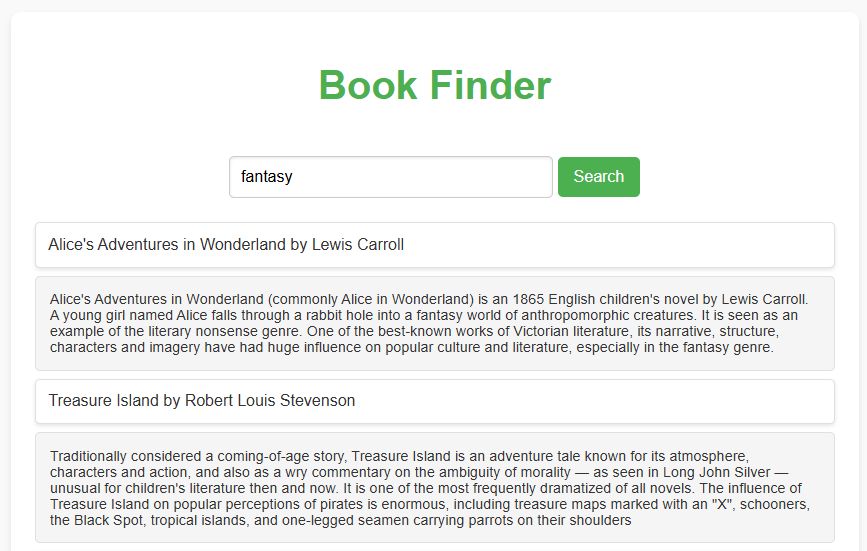

# Book Finder

**Book Finder** è un'applicazione web che consente agli utenti di cercare libri per categoria e visualizzare descrizioni dettagliate dei libri selezionati. L'app utilizza le API pubbliche di [Open Library](https://openlibrary.org/developers/api) per recuperare i dati sui libri e le loro descrizioni.

## **Funzionalità**

- **Ricerca per categoria**: Inserisci una categoria (esempio: fantasy, science, history) per cercare libri.
- **Visualizzazione dei dettagli**: Cliccando su un libro, viene mostrata la descrizione dettagliata direttamente sotto al titolo.
- **Interfaccia reattiva e moderna**: Design minimale e accattivante.

## **Screenshot**

### **Home**

### **Ricerca Libri**

### **Dettagli del Libro**

## **Tecnologie Utilizzate**

- **HTML**: Struttura della pagina.
- **CSS**: Styling e design.
- **JavaScript**: Logica e gestione dinamica dei contenuti.
- **Axios**: Per effettuare chiamate API in modo semplice.
- **Open Library API**:
  - `/subjects/<category>.json` per ottenere i libri in una categoria.
  - `/works/<key>.json` per recuperare i dettagli di un libro.

## **Come Usare Questo Progetto**

## Link al Progetto
Prova l'applicazione qui: [Simple Counter App](https://bookjavascriptbusa.netlify.app/)
